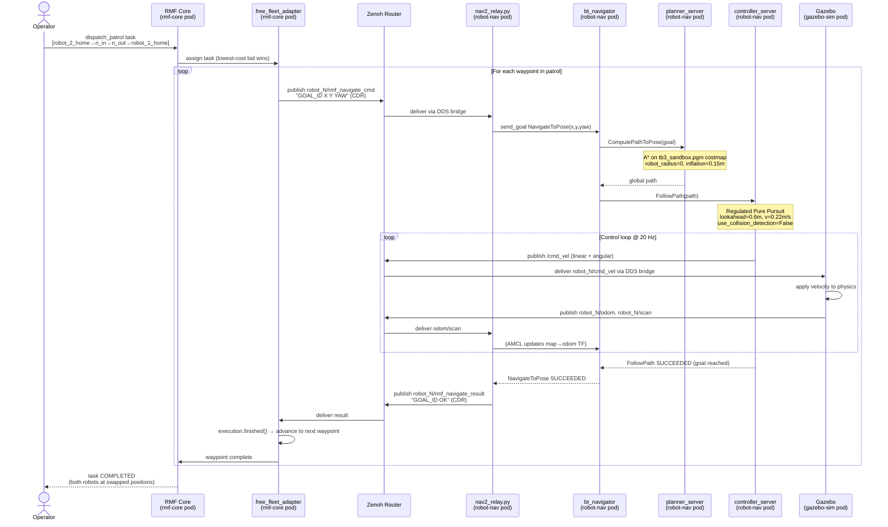

# Two-Robot Swap Demo on OpenShift

A fully cloud-native robotics demo: two TurtleBot3 Waffle robots running
[ROS2 Jazzy](https://docs.ros.org/en/jazzy/) + [Nav2](https://nav2.ros.org/)
inside [OpenShift](https://www.redhat.com/en/technologies/cloud-computing/openshift)
pods, orchestrated by [Open-RMF](https://www.open-rmf.org/), navigating a
Gazebo Harmonic simulation environment through outer-corridor waypoints to swap
positions — without any on-premise hardware.

---

## What the Demo Does

Two robots start at opposite corners of a simulated indoor environment and
**swap positions** simultaneously, each navigating around the outside of a
3×3 pillar grid:

```
robot_1_home(-2, -0.5)   ───south corridor (y=-1.75)───▶   robot_2_home(2, 0.5)
robot_2_home( 2,  0.5)   ───north corridor (y=+1.75)───▶   robot_1_home(-2,-0.5)
```

The entire dispatch pipeline flows through Open-RMF:

```
make dispatch-swap-patrol
      ↓
  RMF dispatch_patrol task
      ↓
  free_fleet_adapter (bidding + execution)
      ↓
  Zenoh CDR pub  →  nav2_relay.py  →  Nav2 navigate_to_pose  →  /cmd_vel  →  Gazebo
```

---

## Sequence Diagram

The diagram below shows the full message flow for one navigation leg
(e.g. `robot_2_home → n_in`). Both robots execute this loop in parallel,
one for each waypoint in their patrol route.



> **Parallel execution**: both robots run the above loop simultaneously.
> RMF's traffic manager deconflicts lane usage — if both robots would need
> the same lane at the same time, one waits until the other clears.

---

## System Architecture

```
┌─────────────────────── OpenShift namespace: ros2-multi-robot ───────────────────────┐
│                                                                                      │
│  ┌────────────────────────┐                                                          │
│  │  Pod: zenoh-router     │  ← central Zenoh hub; all other pods connect here        │
│  │  TCP :7447 (router)    │                                                          │
│  └──────────┬─────────────┘                                                          │
│             │ ClusterIP Service zenoh-router:7447                                    │
│   ┌─────────┴──────────────────────────────────────────────────────────────┐         │
│   │                                                                        │         │
│   ▼                          ▼                        ▼                    ▼         │
│  ┌──────────────────┐  ┌──────────────────┐  ┌──────────────────┐  ┌────────────┐  │
│  │  Pod: gazebo-sim │  │ Pod: robot-nav-1 │  │ Pod: robot-nav-2 │  │ Pod:       │  │
│  │                  │  │                  │  │                  │  │ rmf-core   │  │
│  │  gz sim (server) │  │  nav2 bringup    │  │  nav2 bringup    │  │            │  │
│  │  robot_state_pub │  │  AMCL            │  │  AMCL            │  │ RMF fleet  │  │
│  │  gz→ROS2 bridge  │  │  planner(A*)     │  │  planner(A*)     │  │ adapter    │  │
│  │                  │  │  RPP controller  │  │  RPP controller  │  │ (free_     │  │
│  │  ┌────────────┐  │  │  nav2_relay.py   │  │  nav2_relay.py   │  │  fleet)    │  │
│  │  │zenoh-bridge│  │  │  ┌────────────┐  │  │  ┌────────────┐  │  │            │  │
│  │  │  (sidecar) │  │  │  │zenoh-bridge│  │  │  │zenoh-bridge│  │  │ rmf-web    │  │
│  │  └────────────┘  │  │  │  (sidecar) │  │  │  │  (sidecar) │  │  │ api-server │  │
│  └──────────────────┘  │  └────────────┘  │  │  └────────────┘  │  └────────────┘  │
│                         └──────────────────┘  └──────────────────┘                  │
└──────────────────────────────────────────────────────────────────────────────────────┘
```

### Pod Responsibilities

| Pod | Image | Key Processes |
|-----|-------|---------------|
| `zenoh-router` | `eclipse/zenoh` | Zenoh router (TCP :7447) — the communication backbone |
| `gazebo-sim` | `quay.io/jianrzha/ros2-demo` | Gazebo Harmonic server, ros_gz_bridge, robot_state_publisher |
| `robot-nav-robot-1` | `quay.io/jianrzha/ros2-demo` | Nav2 bringup (AMCL+planner+controller), nav2_relay.py, zenoh-bridge-ros2dds |
| `robot-nav-robot-2` | `quay.io/jianrzha/ros2-demo` | Same as robot-1 but for robot_2 |
| `rmf-core` | `quay.io/jianrzha/ros2-rmf` | free_fleet_adapter, RMF traffic manager, rmf-web API server |

---

## How the Components Work Together

### Zenoh as the Cross-Pod DDS Bridge

Each pod runs a `zenoh-bridge-ros2dds` sidecar that translates between ROS2's
DDS layer (local to the pod's network) and Zenoh pub/sub (routed through the
central `zenoh-router` pod). This allows:

- **Gazebo** to publish `/clock`, `/odom`, `/scan`, `/tf` to Zenoh
- **Nav2 pods** to subscribe to those topics from Zenoh, and to publish
  `/cmd_vel` back to Zenoh so Gazebo can apply it
- **RMF** to send navigation commands and receive robot states via Zenoh

Topic naming uses robot namespaces: `robot_1/cmd_vel`, `robot_2/odom`, etc.
The bridges map these to/from the global ROS2 topic names within each pod.

**Clock relay**: The sim clock (`/clock`) is bridged from Gazebo through Zenoh
to each Nav2 pod. `nav2_relay.py` applies a monotonic filter before re-publishing
to `/clock`, preventing backward timestamp jumps that would clear Nav2's TF buffer.

**cmd_vel keepalive**: The Zenoh bridge only routes `robot_N/cmd_vel` from DDS
to Zenoh while at least one Zenoh subscriber is interested. Each Nav2 pod runs
a persistent Python Zenoh subscriber (the "keepalive") that holds the route open
permanently — without it, the bridge would drop the route between goals and the
robot would stop.

### Nav2 Stack

Each robot runs a complete Nav2 navigation stack in its own pod:

- **AMCL** for localization using a pre-built occupancy map (`tb3_sandbox.pgm`)
- **NavFn A\*** global planner with a point-robot footprint (`robot_radius=0`)
  so that paths can be computed even when the start position is near obstacles
- **Regulated Pure Pursuit (RPP)** controller: tracks a carrot-point on the
  global path, producing forward velocity unconditionally. DWB was rejected
  because its multi-critic trajectory sampling produces zero-velocity local
  minima in the tb3_sandbox pillar grid
- **Collision monitor**: disabled (FootprintApproach.enabled=False) — the pillar
  grid caused false collision detections that zero-suppressed cmd_vel even when
  the robot had a clear path

### Open-RMF and free_fleet

Open-RMF is the fleet management layer. The key components:

- **free_fleet_adapter**: bridges between RMF's abstract `FleetUpdateHandle` API
  and the actual robots. For each navigation step it publishes a CDR-encoded
  string (`GOAL_ID X Y YAW`) to the Zenoh topic `robot_N/rmf_navigate_cmd`
- **RMF traffic manager**: assigns patrol tasks to robots by lowest-cost bidding,
  deconflicts lane usage, and advances the task state machine when each waypoint
  is reached
- **nav2_relay.py**: the Nav2 side of the free_fleet bridge. Subscribes to
  `/rmf_navigate_cmd` (via Zenoh bridge → DDS), translates each command into a
  `NavigateToPose` action goal sent to Nav2's bt_navigator, and publishes the
  result back to `robot_N/rmf_navigate_result`

**Navigation graph**: Defined in `helm/multi-robot-demo/files/nav_graph.yaml`.
The swap demo uses four outer-corridor waypoints (indices 14-17):

```
s_in  (-1.5, -1.75)   s_out ( 1.5, -1.75)   # south corridor for robot_1
n_in  ( 1.5,  1.75)   n_out (-1.5,  1.75)   # north corridor for robot_2
```

These corridors run along y=±1.75, giving 0.65 m clearance from the pillar
rows at y=±1.1 and avoiding the corner wall segments near (±1.8, ±1.8).

### nav2_relay.py — The Critical Bridge

`nav2_relay.py` handles several subtle concurrency challenges:

| Problem | Solution |
|---------|----------|
| RMF sends CANCEL+NAVIGATE pairs every ~20s | CANCEL-ignore: only NAVIGATE triggers action |
| Fleet adapter re-publishes goal every 0.8s | `_last_sent_dest` window: retries within 25s of dispatch are absorbed without creating new Nav2 goals |
| Race between goal completion and retry arrival | `_last_ok_dest` window: recently-completed destinations are reported OK immediately without re-navigation |
| Zombie state (no thread after same-dest transfer) | `_run_active` guard: only one `_run_goal` thread executes at a time; zombie-fix spawns a new thread when `_handle=None` after same-dest transfer |
| TF backward jumps clearing the buffer | Monotonic clock filter on `/clock_bridge → /clock` |

---

## Navigation Map — tb3_sandbox

The simulation world is Gazebo's `tb3_sandbox.pgm`:

- **Outer walls**: y ≈ ±2.65 (south/north)
- **Pillar grid**: 3×3 array at x∈{-1.1, 0, 1.1} × y∈{-1.1, 0, 1.1}, radius 0.15 m
- **Robot width**: 0.44 m (TurtleBot3 Waffle)
- **Corridor clearance**: 0.65 m from pillar row to outer corridor at y=±1.75

```
y=+2.65  ─────────────────────────────── north wall ────────────────────────────
y=+1.75  ···(n_out)──────────────────────────────────(n_in)···  ← north corridor
y=+1.10  ●  ●  ●   ← pillar row
y= 0.00  [r2_home]  ●  ●  ●   ←  pillar row (centre)
y=-1.10  ●  ●  ●   ← pillar row
y=-1.75  ···(s_in)───────────────────────────────────(s_out)···  ← south corridor
y=-2.65  ─────────────────────────────── south wall ────────────────────────────
         x=-2  -1.1    0   +1.1  +2
```

---

## Prerequisites

- **OpenShift** 4.x cluster with GPU/Vulkan not required (software rendering via Mesa/llvmpipe)
- **Helm 3** and **oc CLI** installed locally
- **Podman** (for building images locally)
- Container registry access (default: `quay.io/jianrzha`)

Image tags used:
- `quay.io/jianrzha/ros2-demo:swap-nav2` — Gazebo + Nav2 + nav2_relay
- `quay.io/jianrzha/ros2-rmf:open-rmf` — free_fleet_adapter + RMF + rmf-web

---

## Quick-Start: Running the Demo

### 1. Deploy

```bash
# Install or upgrade all resources in the ros2-multi-robot namespace
make deploy ROS_DEMO_NS=ros2-multi-robot
```

### 2. Wait for the Stack to Initialize (~3-4 min)

After Gazebo, Nav2, and RMF pods are running, AMCL needs time to converge
and Nav2's lifecycle manager to activate. Monitor with:

```bash
make status ROS_DEMO_NS=ros2-multi-robot
```

Both nav pods should show `3/3 Running`. Then verify bt_navigator is active:

```bash
NAV1POD=$(oc get pod -n ros2-multi-robot -l app=robot-nav-robot-1 \
          -o jsonpath='{.items[0].metadata.name}')
oc exec -n ros2-multi-robot $NAV1POD -c nav2 -- bash -c \
  'export HOME=/tmp/ros-home; source /usr/lib64/ros-jazzy/setup.bash; \
   ros2 lifecycle get /bt_navigator'
# Expected: active [3]
```

> **If bt_navigator shows `inactive [2]`**, the lifecycle manager may have timed
> out activating `planner_server` before AMCL published its TF. Run the recovery
> sequence in the Troubleshooting section below.

### 3. Open the Gazebo Viewer

```bash
make routes ROS_DEMO_NS=ros2-multi-robot
```

Open the noVNC URL shown (e.g. `https://novnc-ros2-multi-robot.apps.…/vnc_lite.html`)
to see the Gazebo 3D view. The blue robot is `robot_1` (spawn at -2, -0.5) and
the red robot is `robot_2` (spawn at 2, 0.5).

### 4. Dispatch the Swap

```bash
make dispatch-swap-patrol ROS_DEMO_NS=ros2-multi-robot
```

This dispatches two RMF patrol tasks simultaneously:
- **robot_1**: `robot_1_home → s_in → s_out → robot_2_home`
- **robot_2**: `robot_2_home → n_in → n_out → robot_1_home`

Both robots should begin moving within a few seconds and complete the swap
in roughly 50–55 sim-seconds (~2 minutes of wall time at RTF=0.5).

### 5. Reset and Repeat

```bash
# Full reset: restart Gazebo + Nav2 pods (robots teleport back to spawn)
make restart ROS_DEMO_NS=ros2-multi-robot

# Then wait ~3-4 min for initialization, then dispatch again
make dispatch-swap-patrol ROS_DEMO_NS=ros2-multi-robot
```

---

## Build and Push Images

```bash
# Rebuild the Gazebo/Nav2 image
make build-push REGISTRY=quay.io/jianrzha TAG=swap-nav2

# Rebuild the RMF image (~15-20 min first build, faster with layer cache)
make build-push-rmf REGISTRY=quay.io/jianrzha TAG=open-rmf
```

Always rebuild both images when changing:
- `entrypoints/entrypoint-nav2.sh` (Nav2 params, lifecycle setup, keepalive)
- `entrypoints/nav2_relay.py` (RMF–Nav2 bridge logic)
- `patch_adapter.py` (free_fleet_adapter modifications)

---

## Troubleshooting

### bt_navigator stays `inactive [2]` after startup

The `planner_server` timed out before AMCL published its map→odom TF. This
happens intermittently on busy clusters. Fix:

```bash
NAV_POD=$(oc get pod -n ros2-multi-robot -l app=robot-nav-robot-1 \
          -o jsonpath='{.items[0].metadata.name}')

# 1. Publish initial pose to kick AMCL into localizing
oc exec -n ros2-multi-robot $NAV_POD -c nav2 -- bash -c \
  'export HOME=/tmp/ros-home; source /usr/lib64/ros-jazzy/setup.bash;
   ros2 topic pub /initialpose geometry_msgs/msg/PoseWithCovarianceStamped \
     "{header: {frame_id: map}, pose: {pose: {position: {x: -2.0, y: -0.5}},
       covariance: [0.01,0,0,0,0,0, 0,0.01,0,0,0,0, 0,0,0,0,0,0,
                    0,0,0,0,0,0, 0,0,0,0,0,0, 0,0,0,0,0,0.01]}}" \
     --times 3'

# 2. Wait 15s for TF, then RESET + STARTUP the lifecycle manager
sleep 15
oc exec -n ros2-multi-robot $NAV_POD -c nav2 -- bash -c \
  'export HOME=/tmp/ros-home; source /usr/lib64/ros-jazzy/setup.bash;
   ros2 service call /lifecycle_manager_navigation/manage_nodes \
     nav2_msgs/srv/ManageLifecycleNodes "{command: 3}";
   sleep 5;
   ros2 service call /lifecycle_manager_navigation/manage_nodes \
     nav2_msgs/srv/ManageLifecycleNodes "{command: 0}"'
```

### Both robots don't move after dispatch

Check RMF accepted the tasks (not "battery capacity" error):

```bash
RMFPOD=$(oc get pod -n ros2-multi-robot -l app=rmf-core \
         -o jsonpath='{.items[0].metadata.name}')
oc logs -n ros2-multi-robot $RMFPOD -c rmf-core --since=120s | grep -E "ERROR|task"
```

If you see `insufficient battery capacity`, the nav_graph may have disconnected
the swap-route waypoints. Re-deploy Helm:

```bash
helm upgrade multi-robot-demo helm/multi-robot-demo \
  --namespace ros2-multi-robot --reuse-values
oc rollout restart deployment/rmf-core -n ros2-multi-robot
```

### Robot stops mid-route and doesn't resume

The Zenoh `cmd_vel` route from the Nav2 pod to Gazebo may have dropped. The
permanent keepalive should prevent this, but if it happens:

```bash
# Check: does Gazebo see robot_N's cmd_vel?
GZPOD=$(oc get pod -n ros2-multi-robot -l app=gazebo-sim \
        -o jsonpath='{.items[0].metadata.name}')
oc exec -n ros2-multi-robot $GZPOD -c gazebo -- bash -c \
  'export HOME=/tmp/ros-home; source /usr/lib64/ros-jazzy/setup.bash;
   timeout 8 ros2 topic hz /robot_2/cmd_vel'
```

If rate is 0, do a full `make restart` to restore all Zenoh routes.

### Navigation stalls (progress checker fires after ~10 min wall-time)

The progress checker fires after 300 sim-seconds without 5 cm of movement.
When it fires, Nav2 aborts the current goal and the relay automatically retries.
This self-recovers — just wait an extra ~2 min wall-time for the retry to complete.

---

## Key Configuration Files

| File | Purpose |
|------|---------|
| `helm/multi-robot-demo/files/nav_graph.yaml` | RMF navigation graph — waypoints and lane connectivity |
| `helm/multi-robot-demo/files/fleet_config.yaml` | RMF fleet parameters — battery model, speeds, charger locations |
| `helm/multi-robot-demo/values.yaml` | Helm values — image refs, env vars (INITIAL_X/Y/YAW), resource limits |
| `entrypoints/entrypoint-nav2.sh` | Nav2 pod startup — Nav2 YAML patching, AMCL initialization, lifecycle watchdog |
| `entrypoints/nav2_relay.py` | RMF↔Nav2 bridge — navigate_to_pose dispatch, clock relay, race-condition guards |
| `entrypoints/entrypoint-rmf.sh` | RMF pod startup — free_fleet_adapter launch, sim-clock relay |
| `patch_adapter.py` | Patches free_fleet's nav2_robot_adapter at image build time |
| `Containerfile` | Nav2/Gazebo image (Fedora 43 + ROS2 Jazzy + Nav2 + Zenoh python bindings) |
| `Containerfile.rmf` | RMF image (same base + free_fleet + rmf_demos + rmf-web) |

---

## Known Limitations

### RTF ≈ 0.5 (Half Real-Time)

Gazebo runs at approximately half real-time on the cluster. Navigating a 3-metre
corridor segment takes ~22 real seconds (11 sim-seconds at 0.22 m/s). The full
swap completes in ~2 wall-clock minutes. This is a Gazebo software-rendering
performance limitation — a GPU-accelerated node would reach RTF ≈ 1.0.

### AMCL Localization Drift

AMCL uses a particle filter which struggles in the symmetric pillar-grid corridors
of tb3_sandbox (similar scan patterns at different positions). Drift of 0.1–0.2 m
is typical. In practice this does not affect demo success because:
- The Nav2 planner uses the costmap (not AMCL position) to find paths
- The progress checker tolerates small positional errors
- merge_radius=0.4 m on waypoints gives generous arrival detection

For production use, slam_toolbox in localization mode would provide sub-centimetre
accuracy at the cost of a serialized map pre-generated during a mapping run.

### bt_navigator Lifecycle Startup Race

On a busy OpenShift node, the `planner_server` activation sometimes times out
(83 sim-seconds) before AMCL publishes its map→odom TF. The bond_timeout=300s
YAML patch reduces this, but the RESET+STARTUP recovery procedure (above) is
still occasionally needed on the first attempt. Subsequent `make restart` calls
on the same node succeed reliably once the node's JVM and container overhead settles.

### Zenoh Route Dropout (Legacy Issue, Mitigated)

The zenoh-bridge-ros2dds only bridges DDS→Zenoh for topics where at least one
Zenoh subscriber is active. Historically, the keepalive reconnected every 55s,
creating a brief gap that caused the bridge to retire the `robot_N/cmd_vel`
DDS subscription. This is fixed by holding the keepalive connection open
permanently (`time.sleep(999999)`).

### RMF Traffic Manager Routing

RMF's lane graph routing can find unexpected multi-hop paths through legacy
waypoints if the nav_graph has dense bidirectional lane connectivity. The current
nav_graph isolates legacy outer-wall vertices (18–21: r1_nwall_w/e, r2_swall_e/w)
by giving them zero lanes. If lanes are inadvertently restored, RMF may route
robots through e.g. `n_in → robot_2_home → r1_nwall_e → …` instead of the
direct `n_in → n_out` lane.

### Single Nav2 Domain Per Pod

Each robot's Nav2 stack runs without a ROS2 namespace (isolation is achieved
via Zenoh topic prefixes). This means multiple Nav2 pods **cannot** run on the
same Linux node if DDS discovery is network-scoped — each pod must be on a
separate node, or DDS must be configured with unique domain IDs per pod. The
Helm chart's `nodeAffinity` rules (if set) enforce this.

---

## Makefile Reference

```bash
make deploy              # Helm install/upgrade
make restart             # Rolling restart (Gazebo first, then Nav2 + RMF)
make dispatch-swap-patrol # Dispatch the two-robot swap via RMF patrol tasks
make status              # Pod status
make routes              # Show noVNC/rmf-web URLs
make build-push          # Build + push the Nav2/Gazebo image
make build-push-rmf      # Build + push the RMF image
make rmf-status          # Fleet state from RMF topic
```

---

## Branch and Commit History

This demo lives on the `open-rmf-integration` branch of the
`robots-demo-platform-openshift` repository. The key development milestones:

1. **`main`**: P-controller relay + dedicated zenoh-router pod; single-robot meet demo
2. **`open-rmf-integration`**: Open-RMF + free_fleet + Nav2 ActionClient relay;
   two-robot swap via outer corridors

All significant fixes are documented in the session memory at
`.claude/projects/…/memory/openrmf_integration_fixes.md`.
