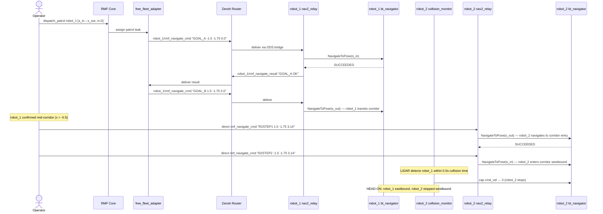

# Multi-Robot ROS2 Demo on OpenShift — RMF Fleet Management + Nav2 LiDAR Collision Avoidance

A cloud-native robotics demo running two TurtleBot3 Waffle robots inside
[OpenShift](https://www.redhat.com/en/technologies/cloud-computing/openshift) pods,
demonstrating [Open-RMF](https://www.open-rmf.org/) fleet management and
[Nav2](https://nav2.ros.org/) LiDAR-based collision avoidance in a
[Gazebo Harmonic](https://gazebosim.org/home) simulation.

---

## What the Demo Shows

Two complementary robotics layers operating simultaneously:

### Layer 1 — Open-RMF Fleet Management (`robot_1`)

`robot_1` is **fully managed by Open-RMF**. A `dispatch_patrol` task flows through
the complete RMF stack:

```
dispatch_patrol
  → RMF task scheduler
    → free_fleet_adapter
      → rmf_navigate_cmd (Zenoh)
        → nav2_relay.py
          → Nav2 bt_navigator → Regulated Pure Pursuit → /cmd_vel → Gazebo
```

RMF tracks `robot_1`'s position, computes ETAs against the nav_graph, and can
send CANCEL commands if the robot's trajectory deviates from its schedule.

### Layer 2 — Nav2 LiDAR Collision Avoidance (`robot_2`)

`robot_2` is **commanded directly via `rmf_navigate_cmd`**, bypassing the fleet
adapter. This demonstrates Nav2's standalone collision avoidance:

- **VoxelLayer**: robot_2's LiDAR scan is processed into a 3D occupancy layer
  in the local costmap. When robot_1 enters the scan range (~3.5 m), its
  footprint appears as an obstacle.
- **`collision_monitor` (FootprintApproach)**: monitors the robot's forward
  footprint projection. When an obstacle is within 0.5 sim-seconds of collision,
  it caps `cmd_vel` to zero — stopping robot_2 before any physical contact.

### What You See in noVNC

1. **robot_1 (blue)** crosses the south outer corridor from west to east,
   guided by the full Open-RMF → Nav2 pipeline (~30–40 s of motion)
2. **robot_2 (red)** navigates from its home southward to the corridor's east
   entry (`s_out`), then turns west heading toward robot_1
3. **robot_2 stops** when its LiDAR scan detects robot_1 inside the
   `FootprintApproach` detection zone — demonstrating LiDAR-based collision
   avoidance in real time

---

## Architecture

```
┌──────────────────────── OpenShift namespace: ros2-multi-robot ──────────────────────────┐
│                                                                                          │
│  ┌────────────────────────┐                                                              │
│  │  Pod: zenoh-router     │  ← central Zenoh hub; all other pods connect here            │
│  │  TCP :7447             │                                                              │
│  └──────────┬─────────────┘                                                              │
│             │                                                                            │
│   ┌─────────┴──────────────────────────────────────────────────────────────┐             │
│   │                                                                        │             │
│   ▼                          ▼                        ▼                    ▼             │
│  ┌──────────────────┐  ┌──────────────────┐  ┌──────────────────┐  ┌────────────────┐  │
│  │  Pod: gazebo-sim │  │ Pod: robot-nav-1 │  │ Pod: robot-nav-2 │  │ Pod: rmf-core  │  │
│  │                  │  │                  │  │                  │  │                │  │
│  │  gz sim (server) │  │  Nav2 bringup    │  │  Nav2 bringup    │  │ free_fleet_    │  │
│  │  robot_state_pub │  │  slam_toolbox    │  │  slam_toolbox    │  │ adapter        │  │
│  │  gz→ROS2 bridge  │  │  planner (A*)    │  │  planner (A*)    │  │ (robot_1 only) │  │
│  │                  │  │  RPP controller  │  │  RPP controller  │  │                │  │
│  │                  │  │  collision_mon   │  │  collision_mon   │  │ RMF traffic    │  │
│  │                  │  │  nav2_relay.py   │  │  nav2_relay.py   │  │ manager        │  │
│  └──────────────────┘  └──────────────────┘  └──────────────────┘  └────────────────┘  │
└──────────────────────────────────────────────────────────────────────────────────────────┘
```

> **Note**: `robot_2` is intentionally excluded from the RMF fleet adapter
> (`fleet_config.yaml`) — see [Known Limitations](#known-limitations) for why.

### Localization: slam_toolbox

Both robots use `localization_slam_toolbox_node` with a pre-built posegraph
(`slam_maps/robot_N_slam`). This gives sub-centimetre accuracy in the outer
corridors, which is necessary for the LiDAR costmap to correctly mark the
other robot's position.

Key parameters that ensure reliable localization on every pod restart:

```
loop_search_maximum_distance = 1.0 m   # prevents wrong-corridor loop closure
```

A 3-attempt TF verification loop checks that the map→odom transform is within
0.30 m of the origin after initialization.

### Message Flow — Hybrid Demo



---

## Navigation Map

```
y=+2.65  ──────────────────────────────── north wall ──────────────────────────────
y=+1.75  ···(n_out)─────────────────────────────────────(n_in)···  ← north corridor
y=+1.10  ●  ●  ●   ← pillar row
y= 0.00  ●  ●  ●   ← pillar row (centre)            robot_2_home (2, 0.5)
y=-1.10  ●  ●  ●   ← pillar row
y=-1.75  ···(s_in)───────────────────────────────────(s_out)···   ← south corridor
y=-2.65  ──────────────────────────────── south wall ──────────────────────────────
          x=-2   -1.1    0   +1.1  +2
robot_1_home (-2, -0.5)
```

**Corridor geometry:**

| Measurement | Value |
|---|---|
| Corridor y-position | y = −1.75 |
| Corridor width (wall to pillar row) | 0.70 m |
| TurtleBot3 Waffle width | 0.44 m |
| Clearance for one robot | 0.26 m |
| Space for two robots side-by-side | **requires 0.88 m — impossible** |

The south corridor is too narrow for two robots to physically pass each other.
The demo shows **sequential transit** (one robot stops, the other holds position),
which is the real-world behavior for single-file narrow corridors.

---

## Quick-Start

### 1. Deploy

```bash
make deploy ROS_DEMO_NS=ros2-multi-robot
```

### 2. Run the Demo

**Always do a full restart before each demo run** to resync the Gazebo sim clock
with the nav2 pods. Skipping this causes `TF_OLD_DATA` errors that prevent
navigation.

```bash
# Step 1: restart all pods (Gazebo first — ensures clock sync)
make restart ROS_DEMO_NS=ros2-multi-robot

# Step 2: dispatch the hybrid demo
make dispatch-rmf-lidar ROS_DEMO_NS=ros2-multi-robot
```

`dispatch-rmf-lidar` performs automatically:
1. Dispatches `robot_1` patrol via Open-RMF (`dispatch_patrol -p s_in s_out -n 3`)
2. Sends `robot_2` to the corridor's east entry (`s_out`) — avoids the pillar grid
3. Monitors `robot_1`'s Gazebo position; when `x > −0.5` (confirmed mid-corridor),
   sends `robot_2` westbound into the corridor toward `robot_1`
4. LiDAR `collision_monitor` on `robot_2` detects `robot_1` and stops `robot_2`

### 3. Watch in noVNC

```bash
make routes ROS_DEMO_NS=ros2-multi-robot
```

Open the displayed noVNC URL to see the Gazebo 3D view.

---

## Known Limitations

### 1. Hybrid Architecture — robot_2 Not Managed by RMF

`robot_2` is commanded directly via `rmf_navigate_cmd`, bypassing the
`free_fleet_adapter`. This is intentional and works around an open upstream bug:

> **open-rmf/rmf_ros2#503** — *"Deadlock when patrolling"* (open)
>
> When two RMF-managed robots simultaneously hold `responsive_wait` claims on
> both endpoints of a bidirectional lane (e.g., robot_1 at `s_in` wanting to go
> east, robot_2 at `s_out` wanting to go west), the fleet adapter cannot break
> the symmetry. Both robots are held indefinitely — neither receives a transit
> command. The scheduler's bilateral negotiation algorithm fails to determine
> priority when both robots arrive at the lane endpoints at the same time.
>
> The root cause is in `rmf_traffic`'s negotiation procedure
> (also tracked in **open-rmf/rmf_traffic#108**).

When `robot_2` is managed by the fleet adapter, it overrides any direct
`rmf_navigate_cmd` by sending `robot_2` back to its home/charger. Removing
`robot_2` from `fleet_config.yaml` prevents this override and allows the direct
command to control the robot cleanly.

**Impact**: the demo cannot show bilateral RMF traffic negotiation (where both
robots are managed by RMF and one yields to the other). It shows:
- ✅ RMF fleet management for `robot_1` (task dispatch, position tracking, ETAs)
- ✅ Nav2 LiDAR collision avoidance for `robot_2` (VoxelLayer + collision_monitor)
- ❌ RMF negotiation protocol (requires fixing rmf_ros2#503 upstream)

### 2. Corridor Too Narrow for Two Robots to Pass

The south outer corridor is 0.70 m wide; two TurtleBot3 robots (0.44 m each)
require 0.88 m to pass side-by-side. Once `robot_2` stops due to the
`collision_monitor`, it cannot navigate around `robot_1` — both robots are
effectively locked until a `make restart`.

The `collision_monitor` correctly implements the safe stop behavior: in a real
deployment, a narrow-corridor deadlock like this would require operator
intervention or a wider corridor with a passing alcove.

### 3. Must Restart Before Each Demo Run

The Nav2 sim clock relay uses a monotonic filter that drops backward-timestamp
messages. When Gazebo is restarted (new sim from time=0), the filter blocks the
new lower-timestamp clock messages, and the nav2 stack's TF buffer fills with
stale data from the previous run (`TF_OLD_DATA` errors). **Always use
`make restart` before each demo** — this restarts Gazebo first, then all nav2
pods, ensuring a clean clock state.

### 4. RTF ≈ 0.5 (Half Real-Time)

Gazebo runs at approximately half real-time on the cluster (software rendering
via Mesa/llvmpipe). A 3 m corridor transit takes ~40 wall-clock seconds. A
GPU-accelerated node would reach RTF ≈ 1.0.

---

## System Components

| Pod | Image | Key Processes |
|-----|-------|---------------|
| `zenoh-router` | `eclipse/zenoh` | Zenoh router (TCP :7447) — cross-pod communication backbone |
| `gazebo-sim` | `quay.io/jianrzha/ros2-demo:swap-nav2-rmf` | Gazebo Harmonic, ros_gz_bridge, robot_state_publisher |
| `robot-nav-robot-1` | same | Nav2, slam_toolbox (localization), nav2_relay.py, collision_monitor, zenoh-bridge |
| `robot-nav-robot-2` | same | Same as robot-1 |
| `rmf-core` | `quay.io/jianrzha/ros2-rmf:latest` | free_fleet_adapter (robot_1 only), RMF traffic manager |

## Key Configuration Files

| File | Purpose |
|------|---------|
| `helm/multi-robot-demo/files/nav_graph.yaml` | RMF nav graph — waypoints, lanes, holding points (`s_in_hold`, `s_out_hold`) |
| `helm/multi-robot-demo/files/fleet_config.yaml` | RMF fleet params — robot_1 only; robot_2 excluded (see Limitations) |
| `entrypoints/entrypoint-nav2.sh` | Nav2 pod startup — slam_toolbox init with TF verification, nav2 param patching |
| `entrypoints/nav2_relay.py` | RMF↔Nav2 bridge — navigate_to_pose dispatch, timed CANCEL (2s), clock relay |
| `slam_maps/` | Pre-built slam_toolbox posegraphs for robot_1 and robot_2 |

## nav2_relay.py — Key Behaviors

| Behavior | Implementation |
|----------|---------------|
| Timed CANCEL (2 s) | CANCEL from RMF waits 2 s; if no NAVIGATE arrives, executes the cancel (enables negotiation yield) |
| Same-dest transfer | RMF re-sends same destination with new ID → relay updates tracking without sending a new Nav2 goal |
| Recent-OK window (10 s) | Destination reached within 10 s → immediate OK without re-navigation |
| Recent-sent window (25 s) | Goal sent within 25 s to same dest → skip (covers fleet-adapter retry interval) |
| Monotonic clock filter | Drops backward sim-clock messages to prevent TF buffer clears on Gazebo restart |

---

## Makefile Reference

```bash
make deploy              # Helm install/upgrade
make restart             # Rolling restart: Gazebo first, then all nav2 + RMF pods
make dispatch-rmf-lidar  # Hybrid demo: RMF robot_1 + direct Nav2 robot_2 (LiDAR stop)
make dispatch-swap-patrol # Legacy: two-robot swap via separate north/south corridors
make routes              # Print noVNC and rmf-web URLs
make status              # Pod status
make build-push          # Build + push the Nav2/Gazebo image
make build-push-rmf      # Build + push the RMF image
```

---

## Supported Demos

The `multi-demo-support` branch runs multiple demos from the same standardized
images, each in its own OpenShift namespace.

| Demo | Namespace | World | Branch | Description | Docs |
|------|-----------|-------|--------|-------------|------|
| **Standalone Nav2** | `ros2-multi-robot` | `tb3_sandbox` | `main` | Two robots with independent Nav2 stacks (AMCL). No RMF — goals sent directly to each robot's nav2 stack. Demonstrates the cross-pod Zenoh bridge architecture. | `main` branch README |
| **tb3_sandbox LiDAR** | `ros2-multi-robot` | `tb3_sandbox` | `multi-demo-support` | RMF fleet management + Nav2 LiDAR head-on collision avoidance. robot_1 (RMF-managed) and robot_2 (direct Nav2) meet in a narrow corridor; collision_monitor stops robot_2 before contact. | This README |
| **turtlebot3_world swap** | `ros2-turtlebot3-world` | `turtlebot3_world` | `multi-demo-support` | Two robots swap spawn positions via separate outer corridors, fully managed by Open-RMF traffic negotiation. | This README |
| **turtlebot3_house patrol** | `ros2-turtlebot3-house` | `turtlebot3_house` | `multi-demo-support` | Two robots patrol opposite corridors of a furnished 3D house world via Open-RMF dispatch and Nav2 online SLAM. | [`docs/turtlebot3-house-demo.md`](docs/turtlebot3-house-demo.md) |
| **RMF hotel world** | `ros2-rmf-hotel` | `hotel` | `rmf-hotel-world-demo` | Multi-level hotel (3 floors, 2 lifts, doors) with three slotcar fleets managed by Open-RMF full-control fleet adapters. Robots ride lifts autonomously between levels. Single pod — no Nav2 or Zenoh required. | [`docs/rmf-hotel-world-demo.md`](docs/rmf-hotel-world-demo.md) |

> **Note**: The **Standalone Nav2** and **tb3_sandbox LiDAR** demos both use the
> `ros2-multi-robot` namespace and cannot run simultaneously. Deploy the Standalone
> demo from the `main` branch; deploy the LiDAR demo from `multi-demo-support`.

### Branch History

| Branch | Purpose |
|--------|---------|
| `main` | Original single-robot meet demo |
| `open-rmf-integration` | First two-robot RMF integration (separate corridors) |
| `swap-nav2-collison-avoidance` | RMF + Nav2 LiDAR head-on demo (tb3_sandbox) |
| `swap-nav2-planning` | Nav2 planning improvements for swap demo |
| `multi-demo-support` | **This branch** — standardized images for multiple demo worlds |
| `turtlebot3-house-demo` | Feature branch — merged into `multi-demo-support` |

---

## Upstream Issues

| Issue | Status | Impact |
|-------|--------|--------|
| [open-rmf/rmf_ros2#503](https://github.com/open-rmf/rmf_ros2/issues/503) — Deadlock when patrolling | Open | Bilateral RMF negotiation on bidirectional lane not possible; requires hybrid approach |
| [open-rmf/rmf_traffic#108](https://github.com/open-rmf/rmf_traffic/issues/108) — Negotiation procedure improvement | Open | Root cause of the deadlock in the traffic scheduler |
